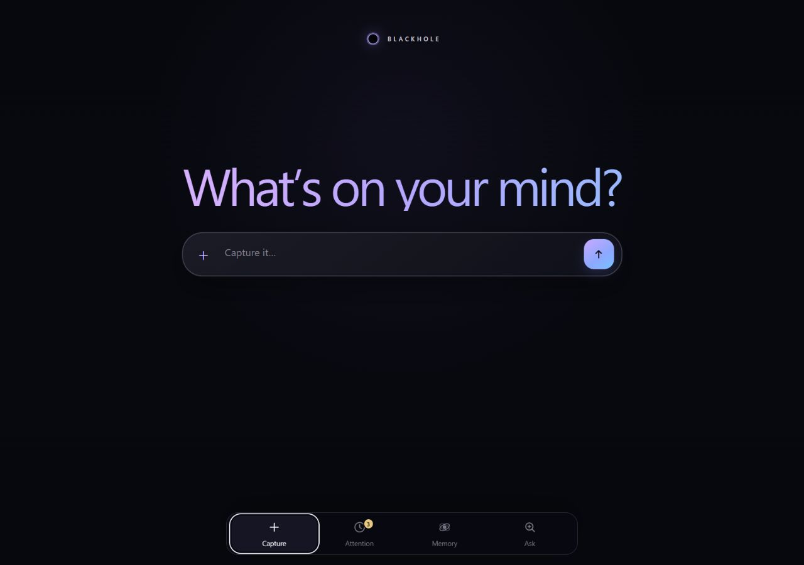
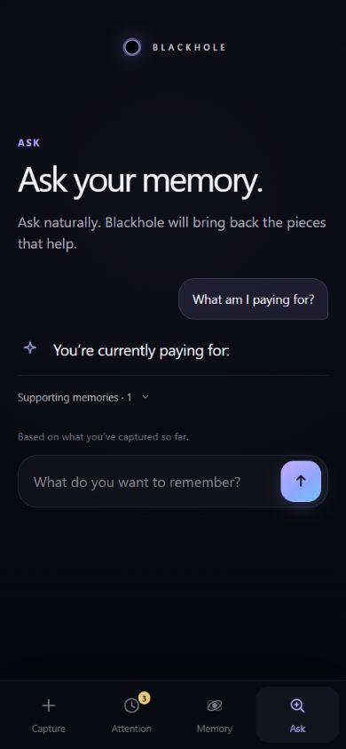

# Blackhole

## Zero-organization external memory

**Capture now.**
**Understand automatically.**
**Find it later.**

Blackhole is a local-first personal inbox for the fragments of ordinary life.
Throw in a reminder, receipt, location, preference, document, or task without
choosing a folder, tag, or schema. The evidence is saved immediately;
understanding happens asynchronously; useful Memory, Attention, and grounded
Ask answers emerge afterward.

This is a frozen Product V2 hackathon submission. Product V2 is a local
single-user application, not production infrastructure.

## The product loop

```text
Capture
   ↓
background understanding
   ↓
Attention / Memory
   ↓
Ask
```

- **Capture** is a zero-friction inbox. `Saved.` means the raw capture is
  durable; it does not wait for a model.
- **Attention** contains things that still need the user: open deadlines,
  unresolved uncertainty, meaningful changes, and proposed actions.
- **Memory** is the current useful state, with history, uncertainty,
  contradictions, and provenance kept visible where they matter.
- **Ask** is natural, bounded retrieval over personal memory. Deterministic
  date, time, and arithmetic paths stay deterministic; bounded semantic
  questions can use the local Codex CLI.
- **Undo** permanently forgets the selected Product V2 capture and its
  source-linked state inside the Product V2 Home. It is an explicit user
  action, not automatic cleanup.

## Quick start

Requirements:

- Python 3.10 or newer;
- an already-installed Codex CLI for asynchronous semantic processing and
  provider-backed Ask; and
- an existing ChatGPT/Codex subscription login owned by that CLI.

From a clean checkout:

```text
git clone https://github.com/iTzRitual/Blackhole.git
cd Blackhole
python -m app.host init
python -m app.host doctor
python -m app.web_app --host 127.0.0.1 --port 8080
```

Open [http://127.0.0.1:8080](http://127.0.0.1:8080).

If semantic processing is needed, authenticate the CLI outside Blackhole:

```text
codex login
```

Blackhole does not ask for an API token and does not read, copy, export, or
persist provider credentials. If the CLI is unavailable, Capture still saves
the evidence and the queue reports an honest retryable state.

The repository's local runtime uses only the Python standard library. The
`BLACKHOLE_HOME` environment variable can point the application at a separate
data directory; otherwise the default is `~/.blackhole/`. For an explicit Home,
pass `--home <blackhole-home>` to `app.host` and `app.web_app` commands. Data
and Product V2's `blackhole-v2.db`/`blobs/` live inside that Home.

Loopback is the supported default. A trusted-private-network phone demo is
available only with an explicit opt-in:

```text
python -m app.web_app --host 0.0.0.0 --port 8080 --trusted-lan-demo
```

This mode has no device authentication, pairing, revocable tokens, or TLS. It
is not safe for the public Internet and is not a production remote-access
solution. Cloud sync and pairing are deferred.

## Safe demo preparation

The repository includes a small, provider-free preparation utility for a
repeatable judge/demo state. It uses the normal Product V2 HTTP routes with
synthetic captures and the visible deterministic acceptance provider; it does
not write benchmark data, bypass the UI with fake answers, or call a live
provider.

Choose a new or empty demo Home, prepare it, then start the normal app against
that same Home:

```text
python scripts/prepare_product_v2_demo.py --home <new-empty-demo-home>
python -m app.web_app --home <new-empty-demo-home> --host 127.0.0.1 --port 8080
```

The seed contains a parking deadline, a Polish preference, a bilingual key
correction, a PocketWave price history, and an uncertain boiler-warranty
mention. The utility refuses a non-empty Home so personal data cannot be
silently mixed into the prepared state. At least one additional Capture should
still be entered live during a demo to show the immediate-save boundary.

The older `?fixture=1` browser mode remains a presentation-only visual-test
fixture. It is not Product V2 state, benchmark data, or submission evidence.

## Screenshots

These screenshots are safe synthetic Product V2 visuals copied from the final
UI review:





No private human dogfood data is included in the published screenshots.

## Trust boundaries

- Raw source evidence is immutable during normal operation. Explicit Undo is
  the narrow, user-authorized permanent-forget exception.
- Derived Memory and Attention are rebuildable from source evidence plus
  versioned rules and semantic output.
- `known`, `inferred`, and `unknown` remain distinct. Missing information is
  not silently turned into zero, false, empty, or complete.
- Arithmetic, dates, comparisons, duplicate checks, lifecycle, and financial
  aggregation are deterministic responsibilities.
- Sending, paying, cancelling, signing, changing an account, or another
  consequential external action is never executed without approval.
- The local Codex CLI owns authentication. Blackhole only records safe
  readiness/status information.

## Product V2 implementation

The integrated application is a same-origin Host/PWA:

- `app.host` owns the local Home and safe readiness checks;
- `app.product_v2` owns immediate capture, the durable queue, bounded worker,
  open-world semantic state, Attention, Ask, attachments, and permanent Undo;
- `app.web_app` exposes the Product V2 HTTP contract; and
- `app/web/` provides the mobile-first PWA.

Product V2's final runtime configuration is `gpt-5.6-luna`, low reasoning, and
batch size 2. These are Product V2 settings. Legacy V1-compatible runtime
defaults and the frozen benchmark configuration remain separate and unchanged.

The current product contract includes language-invariant retrieval, precise
source provenance, current-first Memory, unique unresolved Attention items,
bounded Ask thread context, human-readable values, semantic corrections,
temporal meaning, deterministic occurrence aggregation, attachment persistence,
and permanent Undo. See
[`docs/PRODUCT_SPEC.md`](docs/PRODUCT_SPEC.md) and
[`docs/PRODUCT_V2_INTEGRATION.md`](docs/PRODUCT_V2_INTEGRATION.md).

## Evidence: V1 and Product V2 are different claims

V1 is the scientifically evaluated system. Product V2 is the post-evaluation
product redesign; its acceptance numbers are development/dogfood evidence, not
unseen generalization benchmark scores.

The frozen V1 development track is one public 200-event scenario with
checkpoints at 50, 100, 150, and 200:

- official stateless baseline: `LQA-0M 0.30149145529538973`;
- final kept V1 development reference (Experiment 005):
  `LQA-0M 0.8695006212469447`, `DSCR 40`;
- Experiment 005 made zero provider calls in the recorded replay.

The post-freeze V1R1 result is a **shadow/generalization set of three fresh
synthetic worlds**, not an official holdout and not a significance claim:

- baseline macro LQA `0.2591711465`; Blackhole macro LQA `0.2712347361`;
- absolute delta `+0.0120635896` and reported error-rate reduction `+1.6283908892%`;
- mean successful runtime `3066.475526 s` baseline vs `897.310841 s` Blackhole;
- retries `3` vs `0`, hard failures `0/0`, and schema validity `0/3` vs `3/3`.

Product V2 development acceptance evidence is separate:

- application tests: `200/200 PASS` (including the macOS timezone, live-UX, and relative-day regressions);
- root discovery suite: `217/217 PASS`;
- evaluator tests: `10/10 PASS`;
- acceptance harness: `7/7 PASS`;
- integrated Product V2 acceptance: `50/50 PASS`;
- quality gates: `7/7 PASS`.

The final bounded live UX smoke used four synthetic captures and three Ask
requests in a fresh temporary Home: all requests returned HTTP 200, processing
completed with zero failures/retries, the topic switch stayed current-question-
first, and real occurrence Memory did not become false clarification/conflict
or duplicated history. See the [live runtime trajectory](trajectories/runtime/046-final-live-ask-memory-ui-hotfix/summary.md).

The final relative-day correctness follow-up is recorded in [coding trajectory
047](trajectories/coding/047-relative-day-temporal-hotfix/summary.md). It
anchors relative days to the capture-local calendar date, preserves the capture
timezone for occurrence rendering, and passes the deterministic temporal and
full regression gates without a live provider call.

The engineering lesson is deliberately preserved:

> Optimizing an agent for measurable structured correctness can accidentally
> optimize the product away from the user.

The large DEV improvement transferred weakly to fresh worlds. Human dogfooding
then found real product failures, which led to the Product V2 redesign and the
subsequent lifecycle, provider-schema, Ask-routing, language, provenance,
semantic-truth, Undo, and final human-dogfood repairs. The intermediate
failures are part of the evidence, not hidden from the submission.

## Known limitations

- Capture is immediate, but live background semantic processing is still slower
  than desired. Prior final dogfood measured a first useful state at about
  `23.031 s` and the remaining burst at about `129.562 s`.
- Those are real provider measurements and are not erased by faster
  deterministic fixture timings. The demo should use prepared state rather
  than waiting for a four-item live burst on camera.
- PDFs and other attachments are persisted and surfaced with truthful status,
  but semantic understanding remains limited where the provider cannot read or
  interpret them; no blanket OCR/vision guarantee is made.
- Product V2 is local and single-user. Pairing, cloud sync, hosted deployment,
  and production remote security are deferred.
- Graceful Windows terminal stop logging may remain imperfect in a live launcher
  even though the deterministic clean-stop path is covered.

## Repository and reproducibility map

| Path | Purpose |
| --- | --- |
| `app/` | Host-owned runtime, Product V2, transport, PWA, and legacy V1-compatible code |
| `benchmark/` | Calibration and public development benchmark; holdout ground truth is not here |
| `baseline/` | Fair stateless V1 baseline harness |
| `eval/` | Deterministic evaluator, tests, and recorded result artifacts |
| `product_acceptance/` | Public Product V2 development acceptance cases and harness |
| `docs/` | Product, architecture, submission, demo, process, and reproduction notes |
| `trajectories/` | Coding and runtime evidence, including preserved failures and retries |
| `scripts/` | Safe local preparation and deterministic reproduction helpers |

Judge-facing documents:

- [`docs/SUBMISSION.md`](docs/SUBMISSION.md) — rubric-aligned narrative;
- [`docs/DEMO_SCRIPT.md`](docs/DEMO_SCRIPT.md) — a realistic five-minute demo;
- [`docs/REPRODUCTION.md`](docs/REPRODUCTION.md) — V1 reproduction vs Product V2 local setup;
- [`TRAJECTORY_INDEX.md`](TRAJECTORY_INDEX.md) — coding/runtime evidence map; and
- [`docs/SUBMISSION_CHECKLIST.md`](docs/SUBMISSION_CHECKLIST.md) — final gate status.

## Deterministic verification

From the repository root, the final local gate is:

```text
python -m unittest discover -s . -p "test_*.py" -v
python -m unittest discover -s eval/tests -v
python -m unittest product_acceptance.harness.test_harness -v
python scripts/run_product_v2_integrated_acceptance.py
python -m compileall -q app eval product_acceptance scripts
node --check app/web/app.js
python benchmark/dev/generate_benchmark.py --check
python eval/contract_smoke.py
python scripts/qualification_check.py --inventory
git diff --check
```

The integrated acceptance runner uses a deterministic in-process provider and
temporary Homes. It is not a benchmark scorer. Do not run live provider calls
as part of this deterministic gate.

Read [`AGENTS.md`](AGENTS.md) before changing the repository. The final
submission state, evidence boundaries, and decision history are recorded in
the linked documents above.
